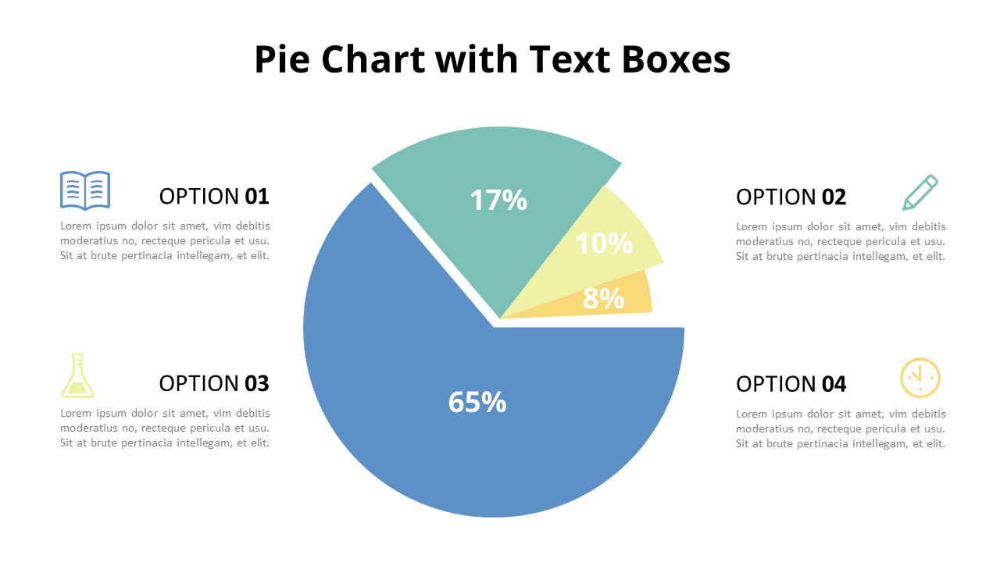

## **PDF and image processing with LLMs: Text extraction, charts and image interpretation.**

In a [recent GenAI project](https://blog.xmartlabs.com/blog/scaling-rag-system/), to give context to the system prompt it was necessary to process a large number of PDF files that were presentations (PPT) from the client's marketing and business area. These PDFs had a lot of charts from past campaigns and market data, some slides had plain text as well. In addition to PDFs, we had to process images, in this case they were supermarket aisles photos and photos uploaded to social networks where you could see different types of products, brands and prices.

PDFs and images were not the only types of files we had to process, it was also necessary to process `xlsx` files that contained scans from social networks (and each of them could have images or not) and Amazon reviews. 

The goal was to be able to have all the data in plain text to later make embeddings and store them in [PGVector](https://github.com/pgvector/pgvector).  Now, when one works with PDFs that have only plain text it is simpler to extract that text because there are native Python libraries such as `pdfplumber`, `PyPDF2` or `fitz` that facilitate the conversion from PDF to plain text. In this case, once the plain text file is obtained, it is straightforward to proceed with the embedding generation (previously partitioning the text). However, when the PDF has images such as charts, product pictures, designs, etc., the aforementioned libraries are no longer sufficient since they do not have the ability to interpret the content in a visual element. 

<aside>
💡

Given a natural language input from a human, one needs to search for the documents that are most related to that human input, which is why it is necessary to embed our data because then, with the human input, [cosine similarity](https://en.wikipedia.org/wiki/Cosine_similarity) is used to find the documents most related to that input.

</aside>

## **Image interpretation**



Suppose that in a PDF (which was originally a PPT) we have many slides with charts, text, diagrams, etc., similar to the example above. We, as humans, have the ability to view such a slide and interpret it. The brain process is similar to:

1. Overview.
2. We detect a title that tells us a very brief summary of what is in the content.
3. We see that there is a pie chart → We analyze the chart detecting that option 1 is predominant with 65% over the total sample. Then we detect that the second most relevant is option 2 with 17%. And so on. Relating the colors of the pie chart with the colors of the labels of each option. 
4. Then we read the description of each element, finding what each object represents (in this case each "option").
5. We can make an analysis, for example: 65% of the sample prefers to read a book, 17% prefers to write an essay, 10% prefers to do various experiments and only 8% spends some time resting.

With all this we could write in plain text an interpretation of such a slide that could be something like:

> On the slide we see a title that is "Pie Chart with Text Boxes". In the content we see a pie chart where we analyze a sample of people who were asked what they spend their free time on. Finding that 65% prefer to spend their free time reading books, 17% prefer to spend it writing essays or personal notes....
> 

Non-multimodal LLMs, such as the one used in this project, are capable of processing only plain text. They do not have the ability to interpret images or visual elements present in documents such as diagrams, chart or photographs. For this reason, it is required that all content is previously interpreted and available in a structured textual format that can be consumed by the model.

### **How to transform visual content from slides into plain text?**

Several years ago, the answer would have been: OCR (*Optical Character Recognition*). This has certain limitations because it would allow us to extract plain text, characters, from any image and convert it to plain text. Today, we have multimodal language models:

<aside>
💡

A multimodal language model is an artificial intelligence model capable of processing and interpreting information coming from multiple types of data, such as text, images, audio or video. In particular, a multimodal language model can understand both written language and visual content (e.g., images), allowing it to reason and generate responses based on both types of input.

</aside>

With this we now have everything we need to answer the question: use a multimodal language model, with a system prompt and delegate everything for the model to interpret and output according to the given instructions. 

### **Are there tools or libraries that already solve this problem?**

The answer is **yes.** Some of the alternatives currently available are:

- [MarkItDown](https://github.com/microsoft/markitdown): a lightweight Python utility for converting various file types to Markdown, designed for use with language models (LLMs) and related text parsing streams.
- [LlamaOCR](https://llamaocr.com/): An AI-powered OCR for converting documents (of any type, and to date without support for PDFs) to Markdown.
- [Docling](https://docling-project.github.io/docling/): simplifies document processing, enabling parsing of various formats - including advanced PDF file understanding, and offering seamless integrations with the generative AI ecosystem.

Given the context of a short and intense project, we only managed to test MarkItDown which what it does is take a PDF and convert it to Markdown using OpenAI. Based on our tests, we did not have good results with PDFs that had a lot of visual elements. On the other hand, by the time of the project we had not yet discovered Docling.

## **Now, let's interpret visual elements**

The main library to be able to do the processing of PDFs and images with a multimodal language model is [Langchain](https://www.langchain.com/). The model used for the PDFs was [`gpt-4.1`](https://openai.com/index/gpt-4-1/).

As an example, our PDF processor is (in a summarized way and without going into so much code)

```python
class DocumentInterpretation(BaseProcessor):
    def __init__(
        self,
        llm: ChatOpenAI,
        parser: PydanticOutputParser,
        prompt: str,
        formatter: str,
    ):
        super().__init__(llm, prompt)

    def __image_to_base64(self, image) -> str:
        """
        Convert an image to a base64-encoded string.

        Args:
            image (_type_): The image to convert.

        Returns:
            str: Base64-encoded string of the image.
        """
        buffer = BytesIO()
        image.save(buffer, format="PNG")
        return base64.b64encode(buffer.getvalue()).decode("utf-8")

    def __extract_images_from_pdf(self, file_path: str) -> list:
        """Convert each page of a PDF file to an image.
        This function uses the pdf2image library to convert each page of a PDF file
        into an image. The images are returned as a list of PIL Image objects.

        The images are resized to a maximum of 2000x2000 pixels.

        Args:
            file_path (str): The path to the PDF file.

        Returns:
            list: A list of PIL Image objects representing each page of the PDF.
        """
        return convert_from_path(file_path, size=(2000, 2000))

    def process_image(
        self,
        base64_img: str,
        max_size: tuple | None = (3000, 3000),
    ) -> tuple[dict[str, Any], dict[str, Any]]:
        resized_image_bytes = self.__resize_image_if_needed(base64_img, max_size)
        img_base64 = base64.b64encode(resized_image_bytes).decode("utf-8")

        system_message = SystemMessage(content=self.prompt)
        human_message = HumanMessage(
            content=[
                {
                    "type": "image_url",
                    "image_url": {"url": f"data:image/png;base64,{img_base64}"},
                },
            ]
        )

        with get_openai_callback() as cb:
            # With structured output, we get the parsed object directly
            parsed_response = self.llm.invoke([system_message, human_message])
            llm_usage_data = {
                "total_tokens_used": cb.total_tokens,
                "prompt_tokens_used": cb.prompt_tokens,
                "completion_tokens_used": cb.completion_tokens,
                "total_cost": cb.total_cost,
            }

        logger.info("Successfully processed image with structured output")
        return parsed_response, llm_usage_data

    def process_document(self, file_path: str) -> dict[str, Any]:
        """Process a PDF document and return the analysis.

        Args:
            file_path (str): The path to the PDF file.

        Returns:
            dict[str, Any]: A dictionary containing the analysis of the document.
        """
        file_ext = os.path.splitext(file_path)[-1].lower()
        assert file_ext in [".pdf"]

        start_time = time.time()
        logger.info(f"Converting PDF pages to images: {file_path}")
        images = self.__extract_images_from_pdf(file_path)

        pages = []
        total_tokens = 0
        total_cost = 0
        for i, img in enumerate(images):
            logger.info(f"Processing page {i + 1}/{len(images)}")
            encoded_img = self.__image_to_base64(img)
            interpretation, llm_usage_data = self.process_image(
                encoded_img, (2000, 2000)
            )
            pages.append(
                {
                    "page_number": i + 1,
                    "llm_usage_data": llm_usage_data,
                    "interpretation": interpretation.model_dump(),  
                }
            )
            total_tokens += llm_usage_data["total_tokens_used"]
            total_cost += llm_usage_data["total_cost"]

        end_time = time.time()

        return {
            "file_name": os.path.basename(file_path),
            "file_type": file_ext,
            "page_count": len(images),
            "total_tokens_used": total_tokens,
            "estimated_cost_usd": round(total_cost, 4),
            "processing_time_seconds": round(end_time - start_time, 2),
            "pages": pages,
        }
```

The important thing about this class is the `process_image` method that works with the system prompt and the human input, which in this case is the image encoded in `base64`. To get the interpretation, we can look at the line containing `parsed_response = self.llm.invoke([system_message, human_message])`, this returns the result of the multimodal LLM. In the background, we use [Structured Outputs](https://platform.openai.com/docs/guides/structured-outputs?api-mode=responses) which allows us to have control over the LLM response respecting a user-defined structure. 

The rest of the code inside the image processing method is simply to have token consumption and price data. Then, the main `process_document` method is in charge of orchestrating everything necessary to process all the pages of the PDF and give as a result

```json
{
   "file_name": "name of the PDF file",
   "file_type": "file extension",
   "page_count": "amount of pages in the PDF file",
   "total_tokens_used": "total tokens used",
   "estimated_cost_usd": "total cost",
   "processing_time_seconds": "time in seconds",
   "pages": "an object with intrepreted data"
}
```

Each `"pages"` object looks like

```json
{
  "text_content": "USB Aromatherapy – Portable and practical...",
  "tables": "| Rank | Idea | Action | ...",
  "charts_and_graphs": "This chart compares fragrance appeal scores...",
  "visual_elements": "One product mockup. Ad for new scent. Appears to be part of campaign.",
  "supermarket_aisles": "",
  "key_insights": [
    "Great way to sync scent with mood.",
    "Concerns about smartphone dependency."
  ],
  "page_summary": "This page presents concept evaluations for aromatherapy devices..."
}
```

And, last but not least, the system prompt:

```markdown
You are an expert document analyst specializing in interpreting complex marketing materials.

You will be shown a scanned image of a page from a PDF document. Your task is to interpret the content and structure of the page, extract relevant information, and return it in a **strict JSON format** that matches a predefined schema.

This document may contain marketing slides, promotional visual sequences, concept cards, product displays, or charts.

Perform the following steps:

---

### Step-by-Step Instructions

1. **Text Extraction**:
   - Extract all visible written text from the page.
   - Preserve logical reading order.
   - Ignore decorative or stylistic artifacts unless they convey meaning.

2. **Table Interpretation**:
   - Detect any tables.
   - Extract structured data in Markdown or CSV format inside a string.
   - Summarize what the table conveys (e.g., comparisons, trends, key metrics).

3. **Chart and Graph Analysis**:
   - Identify charts or graphs.
   - Explain the kind of data being visualized.
   - Describe insights and what the data suggests.

4. **Visual Element Analysis**:
   - Describe other visual elements such as:
     - Logos
     - Concept cards
     - Advertisements
     - Storyboards or sequences
   - Identify the **type** of each visual element.
   - If there’s a **sequence** or **thematic grouping**, describe the relationship.

5. **Supermarket Aisles (If Applicable)**:
   - Only if the image clearly shows supermarket shelves:
     - Identify brands and products.
     - Extract prices (if visible).
     - Describe each item briefly.

6. **Key Quotes & Insights**:
   - Extract 1 to 3 key **insights, slogans, or quotes** from the page.
   - These should be standout pieces that may be useful in presentations or summaries.

7. **Page Summary**:
   - Write a concise, plain-language summary of the overall content and communication of the page.

---

### Output Format

Return your response **as a strict JSON object** with the following fields:


{
  "text_content": "",
  "tables": "",
  "charts_and_graphs": "",
  "visual_elements": "",
  "supermarket_aisles": "",
  "key_insights": [
    "",
    "",
    ""
  ],
  "page_summary": ""
}


- All fields are required.

- If a field has no content, return "" for strings or [] for lists.

- Do not include markdown, extra formatting, or any explanation outside the JSON.

- Only output valid JSON, with no trailing commas or extra text.

---

### Example (shortened)


{
  "text_content": "USB Aromatherapy – Portable and practical...",
  "tables": "| Rank | Idea | Action | ...",
  "charts_and_graphs": "This chart compares fragrance appeal scores...",
  "visual_elements": "One product mockup. Ad for new scent. Appears to be part of campaign.",
  "supermarket_aisles": "",
  "key_insights": [
    "Great way to sync scent with mood.",
    "Concerns about smartphone dependency."
  ],
  "page_summary": "This page presents concept evaluations for aromatherapy devices..."
}
```

It is worth mentioning that even though we are using Structured Outputs, it was useful to detail how the expected output looks like and add a one-shot example of the expected result, doing this we obtained better results than if we had not specified the expected output structure.

### **We already have the interpretation, now what do we do?**

Once we have achieved the goal of processing many visual elements and obtaining an interpretation in json format, it is time to assemble everything in plain text. This is relatively simple because we have to go through each key of the json and extract the value and then arrange everything in plain text.

After that post processing, we use [`langchain_openai.OpenAIEmbeddings`](https://api.python.langchain.com/en/latest/embeddings/langchain_openai.embeddings.base.OpenAIEmbeddings.html) with the [`text-embedding-3-small`](https://platform.openai.com/docs/models/text-embedding-3-small) model together with some partitioning algorithm, for the case of PDFs we used [`langchain_experimental.text_splitter.SemanticChunker`](https://api.python.langchain.com/en/latest/text_splitter/langchain_experimental.text_splitter.SemanticChunker.html). It is very important to use a proper partitioning strategy to avoid future problems, the choice of a semantic partitioner is that it results in the document being partitioned without losing context. That is, it avoids that two or more consecutive partitions have cut text. 

After creating the embeddings, we have everything we need to save our embeddings in the vector store of preference, in our case we use [PGVector](https://github.com/pgvector/pgvector).

## **What about supermarket aisles photos or photos uploaded to social networks?**

For this type of files, the approach was identical to the one used to process PDFs, except that the system prompt and post-processing changes. The biggest difference is that for this case we used the [OpenAI's `o3`](https://openai.com/index/introducing-o3-and-o4-mini/) model which has a higher reasoning capacity, is multimodal and gives much more accurate results for this task given the visual complexity of the processed photos.

## **XLSX file processing**

The same strategy was used for these files with the particularity that in the excels there is plain text that can be extracted without the need to be processed by an LLM. Taking into account that in the case of posts in social networks, if the post had an image attached, it was processed with the same processor that was shown in the PDF section. 

The implementation of the excel processor changes a little but its core is shared with the PDFs and images. In this case, as mentioned in the section on photos, the OpenAI's `o3` model was used for its reasoning capacity. 

For the embeddings, we opted not to partition but to consider each row of the excel as a [Document](https://python.langchain.com/api_reference/core/documents/langchain_core.documents.base.Document.html). At first we tried partitioning, but due to the structure of the data, information was lost between partitions because they were poorly done, so we chose not to partition it. The result was very good.

## **Conclusions**

In recent years, data within companies have gained much relevance. Information that was previously little used, or even not used at all, now has a great potential to be exploited. Initially, data was understood as something structured or unstructured, but without the need for interpretation. 

Nowadays, with the great boom of LLMs and their potential, it opened the playing field to incorporate data that need intensive processing from the interpretative point of view, allowing to exploit even more the documentation of all kinds that a company or industry may have. It is well known that working with PDFs is not an easy task, there are many challenges that developers face, but with the advent of powerful models such as `gpt-4.1` and `o3`, which are multimodal, we can achieve products such as those discussed in this post and in [Scaling RAG Systems: Challenges, Bottlenecks, and Real Solutions.](https://blog.xmartlabs.com/blog/scaling-rag-system/).

Given the difficulty of dealing with PDFs and images, having a processor for these files is a great help and allows us to expand the capabilities of new applications that focus on GenAI.

## **Aknowledgements**

Special thanks to Nicolás Hernandez for his outstanding leadership throughout this project, and to Nicolás Fripp for being an exceptional teammate and collaborator.